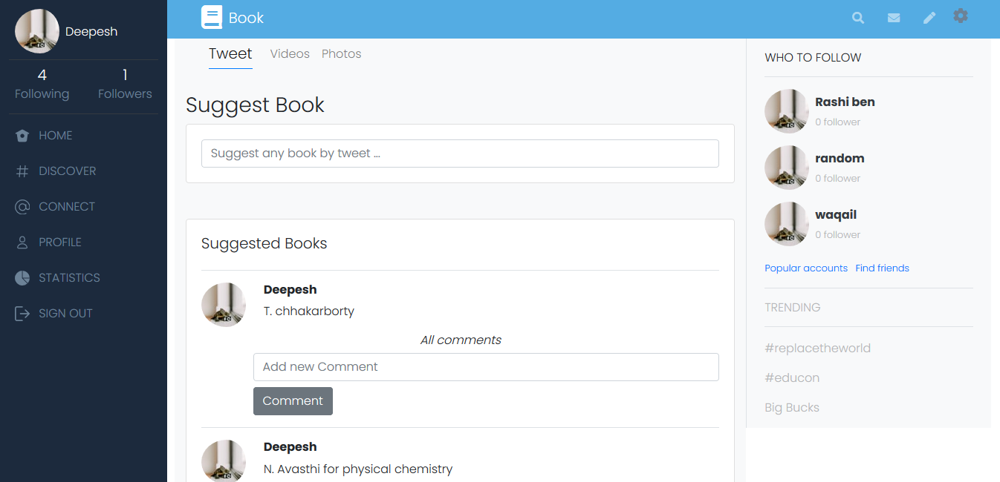

# Twitter Redesign

This project is build for the Ruby on Rails capstone which is based on a redesign of Twitter. It's a real-world-like project, built with business specifications.
      

<div align="center">

[](https://github.com/Dipeshtwis/twitter-redesign)
[](https://github.com/Dipeshtwis/twitter-redesign/issues)
[](https://github.com/Dipeshtwis/twitter-redesign/pulls)

</div>

## 📝 Contents

<p align="center">
<a href="#with">Built with</a>&nbsp;&nbsp;&nbsp;|&nbsp;&nbsp;&nbsp;
<a href="#sc">Screenshot</a>&nbsp;&nbsp;&nbsp;|&nbsp;&nbsp;&nbsp;
<a href="#ll">Live Demo Link</a>&nbsp;&nbsp;&nbsp;|&nbsp;&nbsp;&nbsp;
<a href="#gs">Getting started</a>&nbsp;&nbsp;&nbsp;|&nbsp;&nbsp;&nbsp;
<a href="#author">Author</a>
</p>

## 🔧 Built with<a name = "with"></a>

- Ruby on Rails (Version: 6.0.3.2)
- Ruby (Version: 2.7.1)
- Postgresql (version: 12)

## Screenshot <a name = "sc"></a>

### Home Page



### Profile Page


## Live Demo Link <a name = "ll"></a>

[Live Demo](https://bookhelpy.herokuapp.com)


## Getting Started <a name = "gs"></a>

To get a local copy of the repository please run the following commands on your terminal:

```
$ cd <folder>
```

~~~bash
$ git clone git@github.com:Dipeshtwis/twitter-redesign.git
$ cd twitter-redesign
$ bundle install
$ yarn install --check-files
$ rails db:migrate
~~~

## To run Test

~~~ruby
$ rpsec --format documentation

~~~


## ✒️  Authors <a name = "author"></a>


👤 **Dipesh Kumar**

- Github: [@Dipeshtwis](https://github.com/Dipeshtwis)
- Twitter: [@97deepeshkumar](https://twitter.com/97deepeshkumar)
- Linkedin: [dipeshtwis](https://www.linkedin.com/in/dipeshtwis/)


## 🤝 Contributing

Contributions, issues and feature requests are welcome!

Feel free to check the [issues page](https://github.com/Dipeshtwis/twitter-redesign/issues).


## 👍 Show your support

Give a ⭐️ if you like this project!

## :clap: Acknowledgements

- Design Idea by: [Gregoire Vella](https://www.behance.net/gregoirevella)

- Microverse: [@microverse](https://www.microverse.org/)
